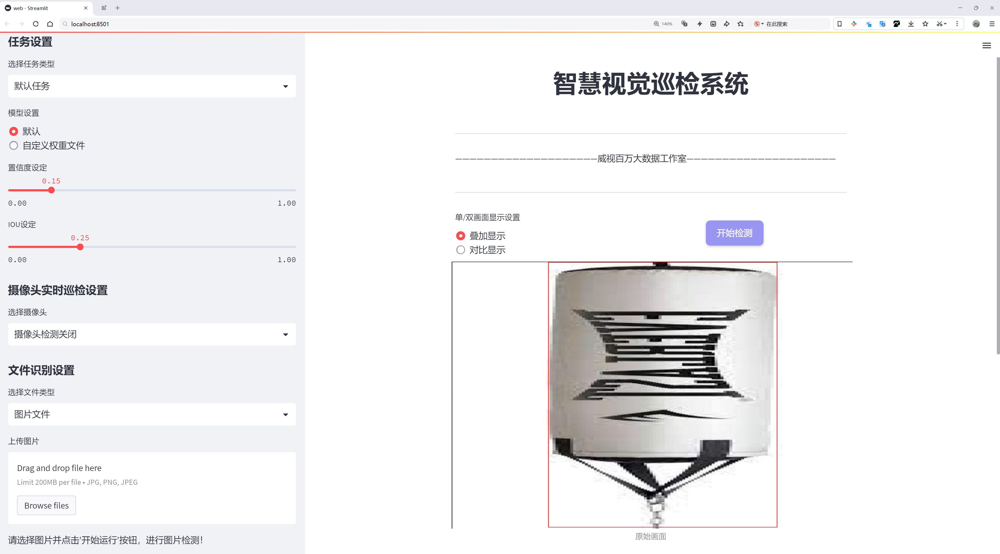
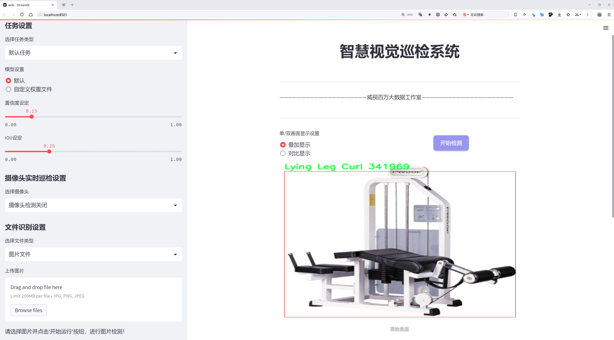
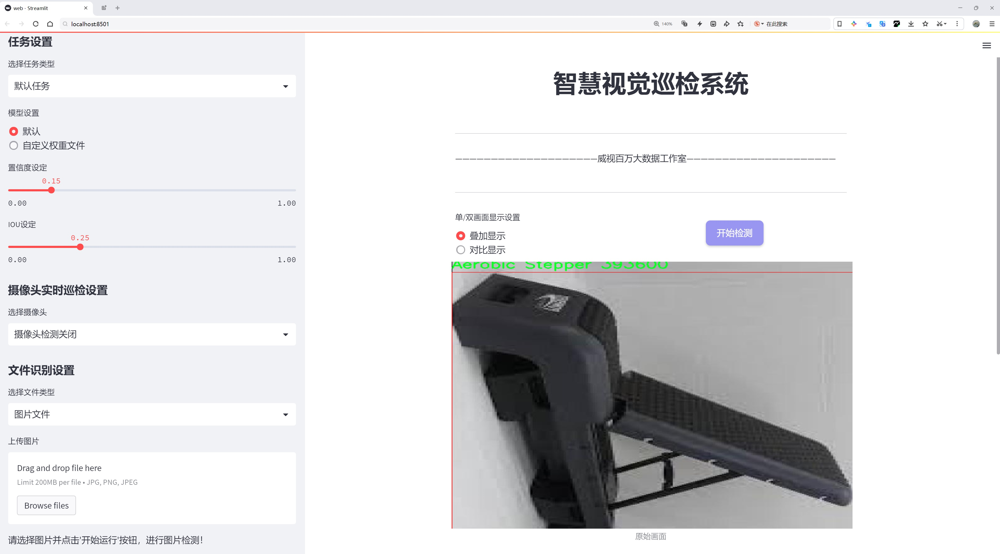
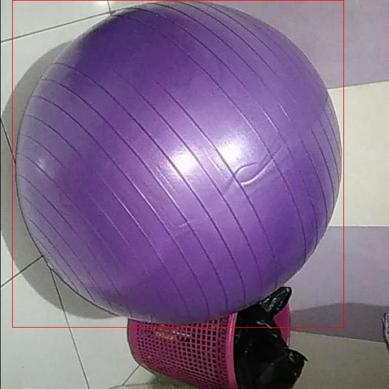
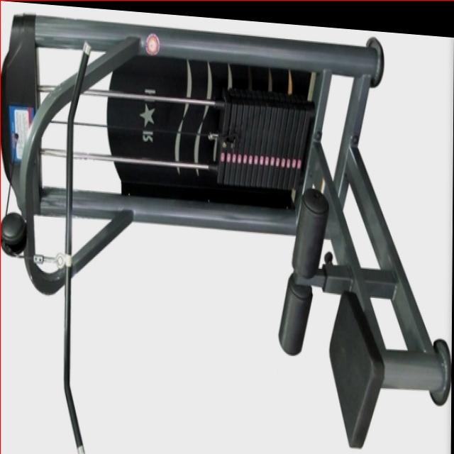
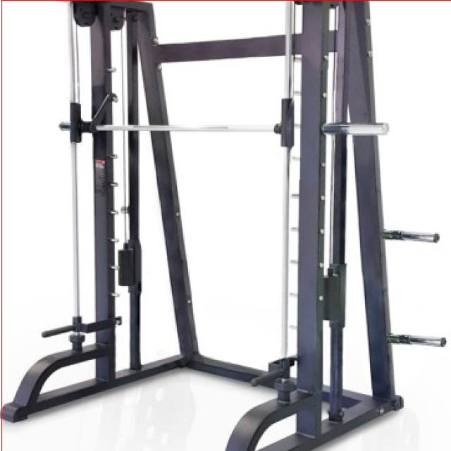
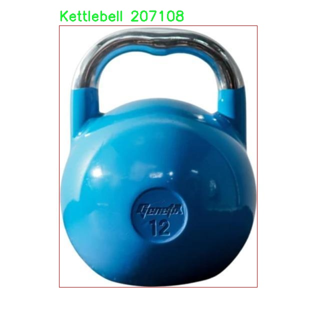
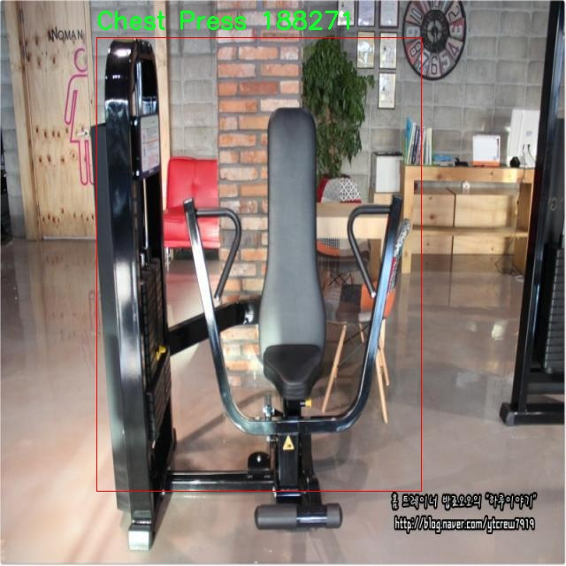

# 健身器材识别检测系统源码分享
 # [一条龙教学YOLOV8标注好的数据集一键训练_70+全套改进创新点发刊_Web前端展示]

### 1.研究背景与意义

项目参考[AAAI Association for the Advancement of Artificial Intelligence](https://gitee.com/qunshansj/projects)

项目来源[AACV Association for the Advancement of Computer Vision](https://gitee.com/qunmasj/projects)

研究背景与意义

随着人们生活水平的提高和健康意识的增强，健身已成为现代生活中不可或缺的一部分。健身器材的使用不仅能够帮助人们提高身体素质，还能有效预防和改善多种健康问题。然而，面对市场上种类繁多的健身器材，用户在选择和使用时常常感到困惑。因此，开发一个高效、准确的健身器材识别系统显得尤为重要。基于改进YOLOv8的健身器材识别系统，旨在通过深度学习技术，提升健身器材的识别精度和速度，为用户提供更加便捷的健身体验。

在当前的健身行业中，传统的健身器材识别方法多依赖于人工识别或简单的图像处理技术，这些方法不仅效率低下，而且容易受到环境因素的影响，导致识别结果不准确。随着计算机视觉和深度学习技术的迅猛发展，基于卷积神经网络（CNN）的目标检测模型逐渐成为解决此类问题的有效工具。YOLO（You Only Look Once）系列模型因其实时性和高准确率而受到广泛关注。YOLOv8作为该系列的最新版本，进一步提升了模型的性能，能够在复杂环境中实现快速、准确的目标检测。

本研究所使用的数据集包含4500张图像，涵盖21类健身器材，包括有氧踏板、哑铃、杠铃、跑步机等多种常见器材。这些数据不仅丰富了模型的训练样本，还为后续的模型评估提供了坚实的基础。通过对这些图像进行标注和分类，研究者能够有效地训练模型，使其具备识别不同健身器材的能力。值得注意的是，数据集中还包含“人”这一类别，这将有助于模型在实际应用中更好地理解健身环境，避免误识别和漏识别的情况。

本研究的意义不仅在于技术层面的创新，更在于其对健身行业的实际应用价值。通过构建基于改进YOLOv8的健身器材识别系统，用户可以在健身过程中实时获取器材信息和使用指导，从而提高锻炼效果。此外，该系统还可以为健身房和个人教练提供数据支持，帮助他们更好地管理器材和制定个性化的健身计划。

总之，基于改进YOLOv8的健身器材识别系统的研究，不仅具有重要的学术价值，也为健身行业的智能化发展提供了新的思路和方法。通过深入探讨深度学习在健身器材识别中的应用，研究者能够推动相关技术的进步，为用户提供更加智能化的健身解决方案，促进健康生活方式的普及与发展。

### 2.图片演示







##### 注意：由于此博客编辑较早，上面“2.图片演示”和“3.视频演示”展示的系统图片或者视频可能为老版本，新版本在老版本的基础上升级如下：（实际效果以升级的新版本为准）

  （1）适配了YOLOV8的“目标检测”模型和“实例分割”模型，通过加载相应的权重（.pt）文件即可自适应加载模型。

  （2）支持“图片识别”、“视频识别”、“摄像头实时识别”三种识别模式。

  （3）支持“图片识别”、“视频识别”、“摄像头实时识别”三种识别结果保存导出，解决手动导出（容易卡顿出现爆内存）存在的问题，识别完自动保存结果并导出到tempDir中。

  （4）支持Web前端系统中的标题、背景图等自定义修改，后面提供修改教程。

  另外本项目提供训练的数据集和训练教程,暂不提供权重文件（best.pt）,需要您按照教程进行训练后实现图片演示和Web前端界面演示的效果。

### 3.视频演示

[3.1 视频演示](https://www.bilibili.com/video/BV1det8euEgE/)

### 4.数据集信息展示

##### 4.1 本项目数据集详细数据（类别数＆类别名）

nc: 24
names: ['Ab Wheel', 'Aerobic Stepper', 'Arm Curl', 'Assisted Chin Up-Dip', 'Back Extension', 'Barbell', 'Cable Machine', 'Chest Fly', 'Chest Press', 'Dumbbell', 'Gymball', 'Hip Abductor', 'Kettlebell', 'Lat Pulldown', 'Leg Extension', 'Leg Press', 'Lying Leg Curl', 'Person', 'Punching Bag', 'Shoulder Press', 'Smith Machine', 'Stationary Bike', 'T-Bar Row', 'Treadmill']


##### 4.2 本项目数据集信息介绍

数据集信息展示

在本研究中，我们采用了名为“Fitness Equipment Recognition”的数据集，以训练和改进YOLOv8模型，旨在实现高效、准确的健身器材识别系统。该数据集专为健身器材的自动识别而设计，涵盖了24个不同的类别，充分反映了现代健身房中常见的器材类型。通过对这些器材的识别，我们希望能够提升健身场所的智能化管理水平，为用户提供更为便捷的健身体验。

该数据集的类别包括多种健身器材，如“Ab Wheel”（腹肌轮）、“Aerobic Stepper”（有氧踏板）、“Arm Curl”（臂弯举器）、“Assisted Chin Up-Dip”（辅助引体向上-双杠）、“Back Extension”（背部伸展器）、“Barbell”（杠铃）、“Cable Machine”（拉力器）、“Chest Fly”（飞鸟机）、“Chest Press”（卧推机）、“Dumbbell”（哑铃）、“Gymball”（健身球）、“Hip Abductor”（髋部外展器）、“Kettlebell”（壶铃）、“Lat Pulldown”（引体向下机）、“Leg Extension”（腿部伸展器）、“Leg Press”（腿部推举机）、“Lying Leg Curl”（卧式腿弯举器）、“Person”（人）、“Punching Bag”（沙袋）、“Shoulder Press”（肩部推举机）、“Smith Machine”（史密斯机）、“Stationary Bike”（固定自行车）、“T-Bar Row”（T杠划船机）以及“Treadmill”（跑步机）。这些类别不仅涵盖了传统的力量训练器材，还包括有氧运动设备，确保了数据集的多样性和全面性。

在数据集的构建过程中，研究团队对每种器材进行了详细的标注和分类，以确保模型在训练时能够获得准确的信息。每个类别的图像均经过精心挑选，确保其在不同角度、光照条件和背景下的表现，增强了模型的鲁棒性和适应性。这种多样化的图像数据不仅提高了模型的识别准确率，还使其在实际应用中能够更好地应对各种复杂场景。

此外，数据集中还包含了“Person”这一类别，旨在模拟健身房中人类用户与器材的互动。这一设计考虑到了实际应用中的场景复杂性，能够帮助模型更好地理解和识别人类与器材之间的关系，从而提升整体识别效果。

通过对“Fitness Equipment Recognition”数据集的深入分析和应用，我们期望能够在健身器材识别领域取得突破性进展。随着深度学习技术的不断发展，YOLOv8模型的改进将使得健身器材的自动识别更加高效、准确，进而推动智能健身设备的普及与应用。未来，我们希望通过该数据集的持续优化和扩展，进一步提升模型的性能，使其能够在更广泛的场景中发挥作用，为健身行业的智能化转型贡献力量。











### 5.全套项目环境部署视频教程（零基础手把手教学）

[5.1 环境部署教程链接（零基础手把手教学）](https://www.ixigua.com/7404473917358506534?logTag=c807d0cbc21c0ef59de5)


[5.2 安装Python虚拟环境创建和依赖库安装视频教程链接（零基础手把手教学）](https://www.ixigua.com/7404474678003106304?logTag=1f1041108cd1f708b01a)

### 6.手把手YOLOV8训练视频教程（零基础小白有手就能学会）

[6.1 手把手YOLOV8训练视频教程（零基础小白有手就能学会）](https://www.ixigua.com/7404477157818401292?logTag=d31a2dfd1983c9668658)

### 7.70+种全套YOLOV8创新点代码加载调参视频教程（一键加载写好的改进模型的配置文件）

[7.1 70+种全套YOLOV8创新点代码加载调参视频教程（一键加载写好的改进模型的配置文件）](https://www.ixigua.com/7404478314661806627?logTag=29066f8288e3f4eea3a4)

### 8.70+种全套YOLOV8创新点原理讲解（非科班也可以轻松写刊发刊，V10版本正在科研待更新）

由于篇幅限制，每个创新点的具体原理讲解就不一一展开，具体见下列网址中的创新点对应子项目的技术原理博客网址【Blog】：


[8.1 70+种全套YOLOV8创新点原理讲解链接](https://gitee.com/qunmasj/good)

### 9.系统功能展示（检测对象为举例，实际内容以本项目数据集为准）

图9.1.系统支持检测结果表格显示

  图9.2.系统支持置信度和IOU阈值手动调节

  图9.3.系统支持自定义加载权重文件best.pt(需要你通过步骤5中训练获得)

  图9.4.系统支持摄像头实时识别

  图9.5.系统支持图片识别

  图9.6.系统支持视频识别

  图9.7.系统支持识别结果文件自动保存

  图9.8.系统支持Excel导出检测结果数据


### 10.原始YOLOV8算法原理

原始YOLOv8算法原理

YOLOv8（You Only Look Once version 8）是目标检测领域的一项重要进展，作为YOLO系列的最新版本，它在原有模型的基础上进行了多项创新和优化，显著提升了检测精度和速度。YOLOv8s模型的架构主要由三个部分组成：Backbone、Neck和Head，这三部分共同协作，完成从输入图像到目标检测结果的全过程。

在特征提取阶段，YOLOv8s采用了CSPDarknet（Cross Stage Partial Darknet）作为其Backbone。CSPDarknet的设计理念是通过将网络分为两个部分，每个部分都包含多个残差块，从而提高特征提取的效率和准确性。与前代YOLOv5相比，YOLOv8s引入了C2f模块替代了C3模块。C2f模块的创新之处在于它将输入的特征图分为两个分支，每个分支通过卷积层进行降维处理，同时引入了v8_C2fBottleneck层。这些Bottleneck层的输出也被作为一个分支，经过堆叠形成更高维度的特征图。这样的设计不仅增加了模型的表达能力，还促进了梯度流的传递，使得网络在训练过程中能够更好地捕捉到特征信息。

在特征提取完成后，YOLOv8s通过快速空间金字塔池化（SPPF）结构进一步处理特征图。SPPF的引入使得模型能够有效提取不同尺度的特征，同时减少了参数量和计算量。这一特征金字塔网络的设计理念在于，通过多尺度特征的融合，增强模型对不同尺寸目标的检测能力。

接下来，YOLOv8s的Neck部分采用了特征金字塔网络（FPN）与路径聚合网络（PAN）的结合。这一结构通过多个卷积层和池化层，对特征图进行处理和压缩，确保了语义信息和定位信息的有效传递。FPN通过构建多层次的特征图，使得模型能够在不同尺度上进行目标检测，而PAN则进一步增强了特征的聚合能力，使得网络能够在不同层次之间有效地传递信息，从而提升了对小目标和大目标的检测性能。

在目标检测阶段，YOLOv8s的Head部分采用了无锚框（Anchor-Free）的检测方式，这一创新使得模型能够直接预测目标的中心点和宽高比例，避免了传统Anchor框带来的复杂性。这种方法不仅提高了检测速度，还增强了检测的准确性，尤其是在复杂场景中，YOLOv8s能够更快速地识别和定位目标。

YOLOv8的整体设计理念是通过高效的特征提取和灵活的目标检测方式，提升模型的性能。其轻量化特性使得YOLOv8s在移动设备和实时应用中表现出色，能够在保证高精度的同时，实现快速的推理速度。此外，YOLOv8s在处理图像时，还引入了Mosaic增强和瞄点计算等预处理技术，这些技术的结合使得模型在面对不同场景和光照条件时，依然能够保持良好的检测性能。

总结而言，YOLOv8s不仅在结构上进行了创新，还在算法上进行了多项优化，特别是在特征提取和目标检测的结合上，展现了其独特的优势。通过C2f模块、SPPF结构、FPN与PAN的结合，以及无锚框的检测方式，YOLOv8s在目标检测的准确性和速度上均取得了显著的提升。这些改进使得YOLOv8s成为了当前目标检测领域的一款高效且灵活的模型，能够广泛应用于各类实际场景中，为计算机视觉的发展提供了新的动力。


### 11.项目核心源码讲解（再也不用担心看不懂代码逻辑）

#### 11.1 code\ultralytics\models\rtdetr\__init__.py

下面是对给定代码的核心部分进行分析和详细注释的结果：

```python
# Ultralytics YOLO 🚀, AGPL-3.0 license

# 从当前包中导入 RTDETR 模型类
from .model import RTDETR

# 从当前包中导入 RTDETR 预测器类
from .predict import RTDETRPredictor

# 从当前包中导入 RTDETR 验证器类
from .val import RTDETRValidator

# 定义该模块的公共接口，包含 RTDETR 模型、预测器和验证器
__all__ = "RTDETRPredictor", "RTDETRValidator", "RTDETR"
```

### 代码分析与注释：

1. **模块导入**：
   - `from .model import RTDETR`：从当前模块的 `model` 文件中导入 `RTDETR` 类，这个类通常是用于定义和构建模型的核心部分。
   - `from .predict import RTDETRPredictor`：从当前模块的 `predict` 文件中导入 `RTDETRPredictor` 类，该类负责使用模型进行预测。
   - `from .val import RTDETRValidator`：从当前模块的 `val` 文件中导入 `RTDETRValidator` 类，该类用于验证模型的性能。

2. **公共接口定义**：
   - `__all__ = "RTDETRPredictor", "RTDETRValidator", "RTDETR"`：定义了该模块的公共接口，表示当使用 `from module import *` 时，只有这三个类会被导入。这有助于控制模块的可见性，避免不必要的内部实现被外部访问。

### 核心部分总结：
该代码片段主要负责模块的结构化，导入必要的类并定义公共接口，以便于其他模块或脚本可以方便地使用这些核心功能。

这个文件是一个Python模块的初始化文件，通常用于定义模块的公共接口。在这个特定的文件中，主要涉及到Ultralytics YOLO（You Only Look Once）项目中的RTDETR（Real-Time DEtection TRansformer）相关功能。

首先，文件开头有一个注释，指出这是Ultralytics YOLO项目的一部分，并且该项目遵循AGPL-3.0许可证。这意味着该项目是开源的，用户可以自由使用和修改，但需要遵循相应的许可证条款。

接下来，文件通过相对导入的方式引入了三个组件：RTDETR模型、RTDETR预测器和RTDETR验证器。具体来说，`from .model import RTDETR`表示从同一目录下的`model`模块中导入`RTDETR`类或函数；`from .predict import RTDETRPredictor`和`from .val import RTDETRValidator`则分别从`predict`和`val`模块中导入`RTDETRPredictor`和`RTDETRValidator`。

最后，`__all__`变量被定义为一个元组，包含了三个字符串：`"RTDETRPredictor"`、`"RTDETRValidator"`和`"RTDETR"`。这个变量的作用是定义当使用`from module import *`语句时，哪些名称是可以被导入的。这是一种控制模块公共接口的方式，确保用户只访问到预期的部分，避免直接访问内部实现细节。

总的来说，这个初始化文件的主要功能是组织和暴露RTDETR相关的模型、预测和验证功能，使得其他模块或用户能够方便地使用这些功能。

#### 11.2 70+种YOLOv8算法改进源码大全和调试加载训练教程（非必要）\ultralytics\models\yolo\detect\train.py

以下是代码中最核心的部分，并附上详细的中文注释：

```python
class DetectionTrainer(BaseTrainer):
    """
    DetectionTrainer类，继承自BaseTrainer类，用于基于检测模型的训练。
    """

    def build_dataset(self, img_path, mode='train', batch=None):
        """
        构建YOLO数据集。

        参数:
            img_path (str): 包含图像的文件夹路径。
            mode (str): 模式，可以是'train'或'val'，用户可以为每种模式自定义不同的增强。
            batch (int, optional): 批次大小，仅用于'rect'模式。默认为None。
        """
        gs = max(int(de_parallel(self.model).stride.max() if self.model else 0), 32)  # 获取模型的最大步幅
        return build_yolo_dataset(self.args, img_path, batch, self.data, mode=mode, rect=mode == 'val', stride=gs)

    def get_dataloader(self, dataset_path, batch_size=16, rank=0, mode='train'):
        """构造并返回数据加载器。"""
        assert mode in ['train', 'val']  # 确保模式是'train'或'val'
        with torch_distributed_zero_first(rank):  # 在分布式训练中，仅初始化数据集一次
            dataset = self.build_dataset(dataset_path, mode, batch_size)  # 构建数据集
        shuffle = mode == 'train'  # 训练模式下打乱数据
        if getattr(dataset, 'rect', False) and shuffle:
            LOGGER.warning("WARNING ⚠️ 'rect=True'与DataLoader的shuffle不兼容，设置shuffle=False")
            shuffle = False  # 如果'rect'为True，则不打乱数据
        workers = self.args.workers if mode == 'train' else self.args.workers * 2  # 设置工作线程数
        return build_dataloader(dataset, batch_size, workers, shuffle, rank)  # 返回数据加载器

    def preprocess_batch(self, batch):
        """对一批图像进行预处理，包括缩放和转换为浮点数。"""
        batch['img'] = batch['img'].to(self.device, non_blocking=True).float() / 255  # 将图像数据转移到设备并归一化
        return batch

    def set_model_attributes(self):
        """设置模型的属性，包括类别数量和类别名称。"""
        self.model.nc = self.data['nc']  # 将类别数量附加到模型
        self.model.names = self.data['names']  # 将类别名称附加到模型
        self.model.args = self.args  # 将超参数附加到模型

    def get_model(self, cfg=None, weights=None, verbose=True):
        """返回一个YOLO检测模型。"""
        model = DetectionModel(cfg, nc=self.data['nc'], verbose=verbose)  # 创建检测模型
        if weights:
            model.load(weights)  # 加载权重
        return model

    def get_validator(self):
        """返回用于YOLO模型验证的DetectionValidator。"""
        self.loss_names = 'box_loss', 'cls_loss', 'dfl_loss'  # 定义损失名称
        return yolo.detect.DetectionValidator(self.test_loader, save_dir=self.save_dir, args=copy(self.args))

    def plot_training_samples(self, batch, ni):
        """绘制带有注释的训练样本。"""
        plot_images(images=batch['img'],
                    batch_idx=batch['batch_idx'],
                    cls=batch['cls'].squeeze(-1),
                    bboxes=batch['bboxes'],
                    paths=batch['im_file'],
                    fname=self.save_dir / f'train_batch{ni}.jpg',
                    on_plot=self.on_plot)

    def plot_metrics(self):
        """从CSV文件中绘制指标。"""
        plot_results(file=self.csv, on_plot=self.on_plot)  # 保存结果图像
```

### 代码核心部分说明：
1. **DetectionTrainer类**：这是一个用于训练YOLO检测模型的类，继承自基础训练类`BaseTrainer`。
2. **build_dataset方法**：构建YOLO数据集，支持训练和验证模式，并根据模型的步幅进行数据集的构建。
3. **get_dataloader方法**：构造数据加载器，支持分布式训练，设置批次大小和工作线程数。
4. **preprocess_batch方法**：对输入的图像批次进行预处理，将图像数据归一化。
5. **set_model_attributes方法**：设置模型的类别数量和名称，确保模型可以正确处理数据。
6. **get_model方法**：返回一个YOLO检测模型，并可选择加载预训练权重。
7. **get_validator方法**：返回用于验证模型的工具，记录损失信息。
8. **plot_training_samples和plot_metrics方法**：用于可视化训练样本和训练指标，帮助监控训练过程。

该程序文件是用于训练YOLO（You Only Look Once）目标检测模型的一个Python脚本，属于Ultralytics YOLO项目的一部分。它继承自一个基础训练类`BaseTrainer`，并提供了一系列方法来构建数据集、加载数据、预处理图像、设置模型属性、获取模型、验证模型、记录损失、显示训练进度、绘制训练样本和指标等功能。

在类`DetectionTrainer`中，首先定义了一个构造数据集的方法`build_dataset`，该方法接收图像路径、模式（训练或验证）和批次大小作为参数。它使用`build_yolo_dataset`函数构建YOLO数据集，并根据模型的步幅设置适当的参数。

接下来，`get_dataloader`方法用于构建数据加载器。它确保在分布式训练中只初始化一次数据集，并根据模式决定是否打乱数据。该方法还会根据训练或验证模式调整工作线程的数量。

`preprocess_batch`方法负责对输入的图像批次进行预处理，将图像数据转换为浮点数并归一化到0到1之间。

`set_model_attributes`方法用于设置模型的属性，包括类别数量和类别名称，这些信息是从数据集中提取的。

`get_model`方法用于返回一个YOLO检测模型，并可选择加载预训练权重。

`get_validator`方法返回一个用于模型验证的`DetectionValidator`实例，记录损失名称以便后续分析。

`label_loss_items`方法生成一个包含训练损失项的字典，便于后续记录和分析。

`progress_string`方法生成一个格式化的字符串，用于显示训练进度，包括当前的epoch、GPU内存使用情况、损失值、实例数量和图像大小。

`plot_training_samples`方法用于绘制训练样本及其标注，帮助可视化训练过程中的数据。

最后，`plot_metrics`和`plot_training_labels`方法分别用于绘制训练过程中的指标和标注图，便于分析模型的训练效果。

整体来看，该文件为YOLO模型的训练提供了全面的支持，涵盖了数据处理、模型构建、训练监控和结果可视化等多个方面。

#### 11.3 ui.py

```python
import sys
import subprocess

def run_script(script_path):
    """
    使用当前 Python 环境运行指定的脚本。

    Args:
        script_path (str): 要运行的脚本路径

    Returns:
        None
    """
    # 获取当前 Python 解释器的路径
    python_path = sys.executable

    # 构建运行命令，使用 streamlit 运行指定的脚本
    command = f'"{python_path}" -m streamlit run "{script_path}"'

    # 执行命令
    result = subprocess.run(command, shell=True)
    # 检查命令执行结果，如果返回码不为0，则表示出错
    if result.returncode != 0:
        print("脚本运行出错。")


# 实例化并运行应用
if __name__ == "__main__":
    # 指定要运行的脚本路径
    script_path = "web.py"  # 假设脚本在当前目录下

    # 调用函数运行脚本
    run_script(script_path)
```

### 代码注释说明：
1. **导入模块**：
   - `sys`：用于获取当前 Python 解释器的路径。
   - `subprocess`：用于执行外部命令。

2. **`run_script` 函数**：
   - 接受一个参数 `script_path`，表示要运行的 Python 脚本的路径。
   - 使用 `sys.executable` 获取当前 Python 解释器的路径。
   - 构建一个命令字符串，使用 `streamlit` 模块运行指定的脚本。
   - 使用 `subprocess.run` 执行构建的命令，并检查返回码以判断脚本是否成功运行。

3. **主程序入口**：
   - 在 `__main__` 块中，指定要运行的脚本路径（这里假设脚本名为 `web.py`）。
   - 调用 `run_script` 函数，传入脚本路径以执行该脚本。

这个程序文件名为 `ui.py`，其主要功能是使用当前的 Python 环境来运行一个指定的脚本，具体是一个名为 `web.py` 的 Streamlit 应用。

首先，程序导入了必要的模块，包括 `sys`、`os` 和 `subprocess`。`sys` 模块用于访问与 Python 解释器相关的变量和函数，`os` 模块提供了与操作系统交互的功能，而 `subprocess` 模块则用于执行外部命令。

接着，程序从 `QtFusion.path` 模块中导入了 `abs_path` 函数，这个函数的作用是获取文件的绝对路径。

在 `run_script` 函数中，程序接收一个参数 `script_path`，这个参数是要运行的脚本的路径。函数首先获取当前 Python 解释器的路径，并将其存储在 `python_path` 变量中。然后，程序构建了一个命令字符串，使用 `streamlit run` 命令来运行指定的脚本。这个命令被封装在双引号中，以确保路径中包含空格时不会出错。

接下来，程序使用 `subprocess.run` 方法来执行构建好的命令。如果命令执行的返回码不为 0，表示脚本运行出错，程序会打印出相应的错误信息。

在文件的最后部分，程序通过 `if __name__ == "__main__":` 语句来判断当前模块是否是主程序。如果是，则指定要运行的脚本路径为 `web.py` 的绝对路径，并调用 `run_script` 函数来执行这个脚本。

总的来说，这个程序的功能是方便地启动一个 Streamlit 应用，通过指定脚本路径来运行相应的 Python 文件。

#### 11.4 train.py

以下是代码中最核心的部分，并附上详细的中文注释：

```python
class DetectionTrainer(BaseTrainer):
    """
    DetectionTrainer类，继承自BaseTrainer类，用于基于检测模型的训练。
    """

    def build_dataset(self, img_path, mode="train", batch=None):
        """
        构建YOLO数据集。

        参数:
            img_path (str): 包含图像的文件夹路径。
            mode (str): 模式，可以是'train'或'val'，用户可以为每种模式自定义不同的数据增强。
            batch (int, optional): 批次大小，仅在'rect'模式下使用。默认为None。
        """
        gs = max(int(de_parallel(self.model).stride.max() if self.model else 0), 32)  # 获取模型的最大步幅
        return build_yolo_dataset(self.args, img_path, batch, self.data, mode=mode, rect=mode == "val", stride=gs)

    def get_dataloader(self, dataset_path, batch_size=16, rank=0, mode="train"):
        """构建并返回数据加载器。"""
        assert mode in ["train", "val"]  # 确保模式是'train'或'val'
        with torch_distributed_zero_first(rank):  # 仅在DDP中初始化数据集*.cache一次
            dataset = self.build_dataset(dataset_path, mode, batch_size)  # 构建数据集
        shuffle = mode == "train"  # 训练模式下打乱数据
        if getattr(dataset, "rect", False) and shuffle:
            LOGGER.warning("WARNING ⚠️ 'rect=True'与DataLoader的shuffle不兼容，设置shuffle=False")
            shuffle = False  # 如果是rect模式，禁用shuffle
        workers = self.args.workers if mode == "train" else self.args.workers * 2  # 设置工作线程数
        return build_dataloader(dataset, batch_size, workers, shuffle, rank)  # 返回数据加载器

    def preprocess_batch(self, batch):
        """对一批图像进行预处理，包括缩放和转换为浮点数。"""
        batch["img"] = batch["img"].to(self.device, non_blocking=True).float() / 255  # 将图像转换为浮点数并归一化
        if self.args.multi_scale:  # 如果启用多尺度
            imgs = batch["img"]
            sz = (
                random.randrange(self.args.imgsz * 0.5, self.args.imgsz * 1.5 + self.stride)
                // self.stride
                * self.stride
            )  # 随机选择图像大小
            sf = sz / max(imgs.shape[2:])  # 计算缩放因子
            if sf != 1:  # 如果缩放因子不为1
                ns = [
                    math.ceil(x * sf / self.stride) * self.stride for x in imgs.shape[2:]
                ]  # 计算新的形状
                imgs = nn.functional.interpolate(imgs, size=ns, mode="bilinear", align_corners=False)  # 进行插值缩放
            batch["img"] = imgs  # 更新图像
        return batch  # 返回处理后的批次

    def get_model(self, cfg=None, weights=None, verbose=True):
        """返回YOLO检测模型。"""
        model = DetectionModel(cfg, nc=self.data["nc"], verbose=verbose and RANK == -1)  # 创建检测模型
        if weights:
            model.load(weights)  # 加载权重
        return model  # 返回模型

    def get_validator(self):
        """返回用于YOLO模型验证的DetectionValidator。"""
        self.loss_names = "box_loss", "cls_loss", "dfl_loss"  # 定义损失名称
        return yolo.detect.DetectionValidator(
            self.test_loader, save_dir=self.save_dir, args=copy(self.args), _callbacks=self.callbacks
        )  # 返回验证器

    def plot_training_samples(self, batch, ni):
        """绘制带有注释的训练样本。"""
        plot_images(
            images=batch["img"],
            batch_idx=batch["batch_idx"],
            cls=batch["cls"].squeeze(-1),
            bboxes=batch["bboxes"],
            paths=batch["im_file"],
            fname=self.save_dir / f"train_batch{ni}.jpg",
            on_plot=self.on_plot,
        )  # 绘制图像并保存

    def plot_metrics(self):
        """从CSV文件中绘制指标。"""
        plot_results(file=self.csv, on_plot=self.on_plot)  # 保存结果图像
```

### 代码核心部分说明：
1. **DetectionTrainer类**：该类负责YOLO模型的训练过程，继承自`BaseTrainer`，并实现了数据集构建、数据加载、模型获取、损失计算等功能。
2. **build_dataset方法**：构建YOLO数据集，支持训练和验证模式，允许用户自定义数据增强。
3. **get_dataloader方法**：创建数据加载器，支持多线程和数据打乱，确保在分布式训练中只初始化一次数据集。
4. **preprocess_batch方法**：对输入的图像批次进行预处理，包括归一化和可选的多尺度调整。
5. **get_model方法**：创建并返回YOLO检测模型，支持加载预训练权重。
6. **get_validator方法**：返回用于模型验证的检测验证器，记录损失信息。
7. **plot_training_samples和plot_metrics方法**：用于可视化训练样本和训练过程中的指标，帮助用户监控训练进度。

这个程序文件 `train.py` 是一个用于训练 YOLO（You Only Look Once）目标检测模型的脚本，基于 Ultralytics 提供的框架。它定义了一个名为 `DetectionTrainer` 的类，该类继承自 `BaseTrainer`，并实现了一系列用于数据集构建、数据加载、模型设置和训练过程中的各种功能。

在这个类中，`build_dataset` 方法用于构建 YOLO 数据集，接收图像路径、模式（训练或验证）和批量大小作为参数。它使用 `build_yolo_dataset` 函数来创建数据集，并根据模型的步幅调整图像的大小。

`get_dataloader` 方法则负责构建和返回数据加载器。它确保在分布式训练中只初始化一次数据集，并根据训练或验证模式设置是否打乱数据。该方法还会根据模式选择合适的工作线程数量。

`preprocess_batch` 方法用于对输入的图像批次进行预处理，包括将图像缩放到合适的大小并转换为浮点数格式。该方法支持多尺度训练，通过随机选择图像大小来增强模型的鲁棒性。

`set_model_attributes` 方法用于设置模型的属性，包括类别数量和类别名称等，以确保模型能够正确处理数据集中的目标。

`get_model` 方法返回一个 YOLO 检测模型实例，并可选择加载预训练权重。

`get_validator` 方法返回一个用于验证模型性能的验证器，记录损失名称并设置保存目录。

`label_loss_items` 方法用于返回带有标签的训练损失项字典，便于后续的损失分析。

`progress_string` 方法返回一个格式化的字符串，显示训练进度，包括当前的轮次、GPU 内存使用情况、损失值、实例数量和图像大小等信息。

`plot_training_samples` 方法用于绘制训练样本及其标注，帮助可视化训练过程中的数据。

最后，`plot_metrics` 和 `plot_training_labels` 方法用于绘制训练过程中的指标和标签，分别从 CSV 文件中读取数据并生成相应的图像，便于分析模型的训练效果。

整体来看，这个文件提供了一个完整的训练流程，包括数据准备、模型设置、训练过程中的监控和结果可视化，适合用于目标检测任务的模型训练。

#### 11.5 code\ultralytics\data\utils.py

以下是代码中最核心的部分，并附上详细的中文注释：

```python
import os
import hashlib
from pathlib import Path
from PIL import Image, ImageOps
import numpy as np

IMG_FORMATS = ("bmp", "jpeg", "jpg", "png", "tif", "tiff")  # 支持的图像格式

def img2label_paths(img_paths):
    """根据图像路径定义标签路径。"""
    sa, sb = f"{os.sep}images{os.sep}", f"{os.sep}labels{os.sep}"  # 定义图像和标签的子字符串
    return [sb.join(x.rsplit(sa, 1)).rsplit(".", 1)[0] + ".txt" for x in img_paths]  # 返回标签路径

def get_hash(paths):
    """返回一组路径（文件或目录）的单一哈希值。"""
    size = sum(os.path.getsize(p) for p in paths if os.path.exists(p))  # 计算路径的总大小
    h = hashlib.sha256(str(size).encode())  # 使用SHA-256算法对大小进行哈希
    h.update("".join(paths).encode())  # 对路径进行哈希
    return h.hexdigest()  # 返回哈希值

def exif_size(img: Image.Image):
    """返回经过EXIF校正的PIL图像大小。"""
    s = img.size  # 获取图像的宽度和高度
    if img.format == "JPEG":  # 仅支持JPEG格式
        exif = img.getexif()  # 获取EXIF信息
        if exif:
            rotation = exif.get(274, None)  # 获取图像的方向信息
            if rotation in [6, 8]:  # 如果图像需要旋转
                s = s[1], s[0]  # 交换宽度和高度
    return s  # 返回校正后的大小

def verify_image(args):
    """验证单个图像的有效性。"""
    (im_file, cls), prefix = args  # 解包参数
    nf, nc, msg = 0, 0, ""  # 初始化计数器和消息
    try:
        im = Image.open(im_file)  # 打开图像文件
        im.verify()  # 验证图像
        shape = exif_size(im)  # 获取图像大小
        shape = (shape[1], shape[0])  # 转换为(height, width)格式
        assert (shape[0] > 9) & (shape[1] > 9), f"图像大小 {shape} 小于10像素"  # 确保图像大小有效
        assert im.format.lower() in IMG_FORMATS, f"无效的图像格式 {im.format}"  # 确保图像格式有效
        if im.format.lower() in ("jpg", "jpeg"):
            with open(im_file, "rb") as f:
                f.seek(-2, 2)  # 移动到文件末尾
                if f.read() != b"\xff\xd9":  # 检查JPEG文件是否损坏
                    ImageOps.exif_transpose(Image.open(im_file)).save(im_file, "JPEG", subsampling=0, quality=100)  # 修复损坏的JPEG
                    msg = f"{prefix}警告 ⚠️ {im_file}: 损坏的JPEG已恢复并保存"
        nf = 1  # 图像验证通过
    except Exception as e:
        nc = 1  # 记录损坏的图像
        msg = f"{prefix}警告 ⚠️ {im_file}: 忽略损坏的图像/标签: {e}"
    return (im_file, cls), nf, nc, msg  # 返回验证结果

def verify_image_label(args):
    """验证图像和标签的有效性。"""
    im_file, lb_file, prefix, keypoint, num_cls, nkpt, ndim = args  # 解包参数
    nm, nf, ne, nc, msg, segments, keypoints = 0, 0, 0, 0, "", [], None  # 初始化计数器和消息
    try:
        # 验证图像
        im = Image.open(im_file)
        im.verify()  # 验证图像
        shape = exif_size(im)  # 获取图像大小
        shape = (shape[1], shape[0])  # 转换为(height, width)格式
        assert (shape[0] > 9) & (shape[1] > 9), f"图像大小 {shape} 小于10像素"  # 确保图像大小有效
        assert im.format.lower() in IMG_FORMATS, f"无效的图像格式 {im.format}"  # 确保图像格式有效

        # 验证标签
        if os.path.isfile(lb_file):
            nf = 1  # 标签文件存在
            with open(lb_file) as f:
                lb = [x.split() for x in f.read().strip().splitlines() if len(x)]  # 读取标签文件
                lb = np.array(lb, dtype=np.float32)  # 转换为numpy数组
            nl = len(lb)  # 标签数量
            if nl:
                assert lb.shape[1] == 5, f"标签需要5列, 检测到 {lb.shape[1]} 列"  # 确保标签格式正确
                points = lb[:, 1:]  # 提取坐标点
                assert points.max() <= 1, f"坐标超出范围 {points[points > 1]}"  # 确保坐标在有效范围内
                assert lb.min() >= 0, f"标签值为负 {lb[lb < 0]}"  # 确保标签值非负
            else:
                ne = 1  # 标签为空
                lb = np.zeros((0, 5), dtype=np.float32)  # 创建空标签
        else:
            nm = 1  # 标签缺失
            lb = np.zeros((0, 5), dtype=np.float32)  # 创建空标签
        return im_file, lb, shape, segments, keypoints, nm, nf, ne, nc, msg  # 返回验证结果
    except Exception as e:
        nc = 1  # 记录损坏的图像/标签
        msg = f"{prefix}警告 ⚠️ {im_file}: 忽略损坏的图像/标签: {e}"
        return [None, None, None, None, None, nm, nf, ne, nc, msg]  # 返回错误信息
```

以上代码片段包括了图像和标签的验证、路径处理、哈希计算等核心功能，并提供了详细的中文注释以帮助理解每个函数的作用和逻辑。

这个程序文件 `utils.py` 是 Ultralytics YOLO 项目的一部分，主要用于处理与数据集相关的各种实用功能。代码中包含多个函数和类，主要功能包括图像和标签的验证、数据集的下载和检查、图像的压缩和分割等。

首先，文件导入了一些必要的库和模块，包括文件处理、图像处理、数学运算、以及与 YOLO 相关的工具函数。定义了一些常量，比如支持的图像和视频格式，以及全局的内存锁定设置。

接下来的几个函数主要用于处理图像和标签的路径。`img2label_paths` 函数根据图像路径生成对应的标签路径。`get_hash` 函数计算给定路径列表的哈希值，以便于文件的完整性检查。

`exif_size` 函数用于获取图像的实际尺寸，考虑了图像的 EXIF 信息，特别是 JPEG 格式的图像。`verify_image` 和 `verify_image_label` 函数则用于验证单个图像或图像-标签对的有效性，包括检查图像格式、尺寸和标签的完整性。

接下来的几个函数处理多边形和掩码的转换。`polygon2mask` 和 `polygons2masks` 函数将多边形转换为二进制掩码，适用于图像分割任务。`polygons2masks_overlap` 函数则生成重叠掩码，适用于需要处理多个重叠区域的情况。

`find_dataset_yaml` 函数用于查找与数据集相关的 YAML 文件，确保数据集的格式符合要求。`check_det_dataset` 和 `check_cls_dataset` 函数用于检查检测和分类数据集的有效性，包括下载数据集、解析 YAML 文件、检查数据集路径等。

`HUBDatasetStats` 类用于生成 HUB 数据集的 JSON 文件和目录。该类的构造函数处理数据集的初始化，包括解压数据集、加载 YAML 文件、检查数据集的有效性等。类中还包含方法用于生成数据集的统计信息和处理图像。

最后，`compress_one_image` 函数用于压缩单个图像，保持其长宽比和质量。`autosplit` 函数则自动将数据集划分为训练、验证和测试集，并将结果保存到文本文件中。

整体来看，这个文件提供了一系列功能强大的工具，旨在简化数据集的管理和处理，确保数据的质量和格式符合 YOLO 模型的要求。

#### 11.6 code\ultralytics\utils\instance.py

以下是代码中最核心的部分，并附上详细的中文注释：

```python
import numpy as np

class Bboxes:
    """
    处理边界框的类，支持多种边界框格式（如 'xyxy', 'xywh', 'ltwh'）。
    边界框数据应以 numpy 数组的形式提供。

    属性:
        bboxes (numpy.ndarray): 存储边界框的二维 numpy 数组。
        format (str): 边界框的格式（'xyxy', 'xywh', 或 'ltwh'）。
    """

    def __init__(self, bboxes, format="xyxy") -> None:
        """使用指定格式的边界框数据初始化 Bboxes 类。"""
        # 确保格式有效
        assert format in ["xyxy", "xywh", "ltwh"], f"无效的边界框格式: {format}"
        # 如果 bboxes 是一维数组，则将其转换为二维数组
        bboxes = bboxes[None, :] if bboxes.ndim == 1 else bboxes
        # 确保 bboxes 是二维数组且每个边界框有四个坐标
        assert bboxes.ndim == 2
        assert bboxes.shape[1] == 4
        self.bboxes = bboxes  # 存储边界框
        self.format = format  # 存储边界框格式

    def convert(self, format):
        """将边界框格式从一种类型转换为另一种类型。"""
        assert format in ["xyxy", "xywh", "ltwh"], f"无效的边界框格式: {format}"
        if self.format == format:
            return  # 如果格式相同，则不需要转换
        # 根据当前格式和目标格式选择转换函数
        if self.format == "xyxy":
            func = xyxy2xywh if format == "xywh" else xyxy2ltwh
        elif self.format == "xywh":
            func = xywh2xyxy if format == "xyxy" else xywh2ltwh
        else:
            func = ltwh2xyxy if format == "xyxy" else ltwh2xywh
        self.bboxes = func(self.bboxes)  # 执行转换
        self.format = format  # 更新格式

    def areas(self):
        """返回每个边界框的面积。"""
        self.convert("xyxy")  # 确保边界框格式为 'xyxy'
        # 计算面积: (右下角 x - 左上角 x) * (右下角 y - 左上角 y)
        return (self.bboxes[:, 2] - self.bboxes[:, 0]) * (self.bboxes[:, 3] - self.bboxes[:, 1])

    def __len__(self):
        """返回边界框的数量。"""
        return len(self.bboxes)

    @classmethod
    def concatenate(cls, boxes_list: List["Bboxes"], axis=0) -> "Bboxes":
        """
        将多个 Bboxes 对象合并为一个 Bboxes 对象。

        参数:
            boxes_list (List[Bboxes]): 要合并的 Bboxes 对象列表。
            axis (int, optional): 合并的轴，默认为 0。

        返回:
            Bboxes: 包含合并后边界框的新 Bboxes 对象。
        """
        assert isinstance(boxes_list, (list, tuple))
        if not boxes_list:
            return cls(np.empty(0))  # 如果列表为空，返回一个空的 Bboxes 对象
        assert all(isinstance(box, Bboxes) for box in boxes_list)  # 确保所有元素都是 Bboxes 对象

        if len(boxes_list) == 1:
            return boxes_list[0]  # 如果只有一个对象，直接返回
        # 合并所有边界框
        return cls(np.concatenate([b.bboxes for b in boxes_list], axis=axis))

    def __getitem__(self, index) -> "Bboxes":
        """
        使用索引检索特定的边界框或一组边界框。

        参数:
            index (int, slice, or np.ndarray): 用于选择所需边界框的索引、切片或布尔数组。

        返回:
            Bboxes: 包含所选边界框的新 Bboxes 对象。
        """
        if isinstance(index, int):
            return Bboxes(self.bboxes[index].view(1, -1))  # 返回单个边界框
        b = self.bboxes[index]  # 根据索引获取边界框
        assert b.ndim == 2, f"索引 {index} 返回的结果不是二维矩阵！"
        return Bboxes(b)  # 返回新的 Bboxes 对象
```

### 代码核心部分说明：
1. **Bboxes 类**：该类用于处理边界框，支持多种格式（如 'xyxy', 'xywh', 'ltwh'）。
2. **初始化方法**：在初始化时检查边界框格式的有效性，并确保输入的边界框数据是二维数组。
3. **格式转换**：提供了一个方法用于在不同格式之间转换边界框。
4. **面积计算**：可以计算每个边界框的面积。
5. **合并和索引**：支持合并多个 Bboxes 对象和通过索引获取特定的边界框。

这个程序文件定义了一个用于处理边界框（bounding boxes）的类库，主要用于计算机视觉任务中，特别是在目标检测中。文件中包含两个主要的类：`Bboxes`和`Instances`，它们分别用于处理边界框和图像中检测到的对象的实例。

首先，`Bboxes`类负责管理边界框的不同格式，包括`xyxy`（左上角和右下角坐标）、`xywh`（中心坐标和宽高）以及`ltwh`（左上角坐标和宽高）。在初始化时，`Bboxes`类会验证输入的边界框格式是否有效，并确保输入的边界框数据是一个二维的NumPy数组。该类提供了多种方法来转换边界框格式、计算面积、缩放和偏移边界框等操作。

`Bboxes`类的`convert`方法可以将边界框从一种格式转换为另一种格式，`areas`方法计算每个边界框的面积，`mul`和`add`方法分别用于缩放和偏移边界框的坐标。此外，`Bboxes`类还支持通过索引获取特定的边界框，和将多个`Bboxes`对象合并为一个。

接下来，`Instances`类是一个更高级的容器，除了包含边界框外，还可以存储对象的分割区域（segments）和关键点（keypoints）。在初始化时，`Instances`类会创建一个`Bboxes`对象来处理边界框，并可以接收分割和关键点数据。该类提供了方法来转换边界框格式、计算边界框面积、缩放、归一化和去除零面积的边界框等。

`Instances`类的`scale`和`normalize`方法可以对边界框、分割和关键点进行缩放和归一化处理，`clip`方法则用于确保所有坐标都在图像边界内。该类还支持通过索引获取特定的实例，并提供了翻转和添加填充的功能，以适应不同的图像处理需求。

最后，两个类都实现了合并功能，可以将多个`Bboxes`或`Instances`对象合并为一个，以便于批量处理。整体来看，这个文件为处理目标检测中的边界框和相关数据提供了灵活而强大的工具。

### 12.系统整体结构（节选）

### 整体功能和构架概括

该项目是一个基于 YOLO（You Only Look Once）目标检测框架的实现，包含了多个模块和工具，旨在提供高效的目标检测训练和推理功能。项目的结构包括数据处理、模型训练、用户界面、工具函数和实例管理等多个方面。每个模块都负责特定的功能，协同工作以实现完整的目标检测流程。

- **数据处理**：负责数据集的加载、验证和预处理，确保输入数据的质量和格式符合模型要求。
- **模型训练**：实现了 YOLO 模型的训练过程，包括数据加载、模型设置、训练监控和结果可视化。
- **用户界面**：提供了一个简单的界面，用于启动和运行模型训练或推理。
- **工具函数**：包含了多种实用工具，帮助处理图像、边界框和其他与目标检测相关的数据。
- **实例管理**：管理目标检测中的实例，包括边界框、分割区域和关键点等。

### 文件功能整理表

| 文件路径                                                                 | 功能描述                                                                                          |
|--------------------------------------------------------------------------|---------------------------------------------------------------------------------------------------|
| `code/ultralytics/models/rtdetr/__init__.py`                            | 初始化 RTDETR 模块，导入模型、预测器和验证器，并定义公共接口。                                   |
| `70+种YOLOv8算法改进源码大全和调试加载训练教程（非必要）/ultralytics/models/yolo/detect/train.py` | 训练 YOLO 模型的脚本，包含数据集构建、数据加载、模型设置和训练过程监控等功能。                  |
| `ui.py`                                                                 | 启动 Streamlit 应用的脚本，用于运行指定的 Python 脚本（如 `web.py`）。                          |
| `train.py`                                                              | 训练 YOLO 模型的脚本，提供数据处理、模型构建和训练监控功能。                                     |
| `code/ultralytics/data/utils.py`                                        | 提供数据集处理的实用工具，包括图像和标签验证、数据集下载和检查、图像压缩和分割等功能。          |
| `code/ultralytics/utils/instance.py`                                    | 管理边界框和实例数据的类库，提供边界框格式转换、面积计算、缩放和合并等功能。                   |
| `code/ultralytics/assets/__init__.py`                                   | 初始化资产模块，通常用于管理项目中的静态资源（如图像、模型权重等）。                           |
| `code/ultralytics/utils/tuner.py`                                       | 提供超参数调优的工具，帮助优化模型的训练过程。                                                  |
| `70+种YOLOv8算法改进源码大全和调试加载训练教程（非必要）/ultralytics/models/sam/build.py` | 构建 SAM（Segment Anything Model）模型的脚本，可能包括模型的初始化和训练过程。                  |
| `code/ultralytics/models/yolo/obb/predict.py`                          | 处理 YOLO 模型的预测功能，执行目标检测并返回检测结果。                                          |
| `code/ultralytics/utils/callbacks/raytune.py`                          | 提供与 Ray Tune 相关的回调功能，用于超参数调优和模型训练监控。                                   |
| `code/ultralytics/models/yolo/model.py`                                 | 定义 YOLO 模型的结构和前向传播逻辑，负责模型的构建和训练过程。                                   |
| `70+种YOLOv8算法改进源码大全和调试加载训练教程（非必要）/ultralytics/models/rtdetr/model.py` | 定义 RTDETR 模型的结构和前向传播逻辑，负责 RTDETR 模型的构建和训练过程。                       |

以上表格总结了每个文件的主要功能，帮助理解整个项目的结构和各个模块之间的关系。

注意：由于此博客编辑较早，上面“11.项目核心源码讲解（再也不用担心看不懂代码逻辑）”中部分代码可能会优化升级，仅供参考学习，完整“训练源码”、“Web前端界面”和“70+种创新点源码”以“13.完整训练+Web前端界面+70+种创新点源码、数据集获取”的内容为准。

### 13.完整训练+Web前端界面+70+种创新点源码、数据集获取


# [下载链接：https://mbd.pub/o/bread/ZpuWlJpw](https://mbd.pub/o/bread/ZpuWlJpw)